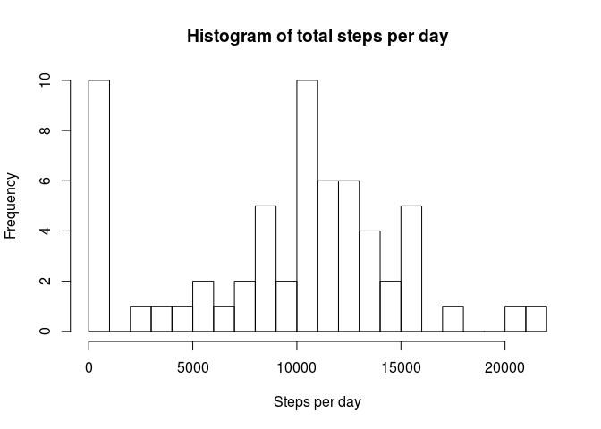
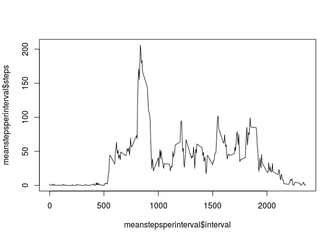
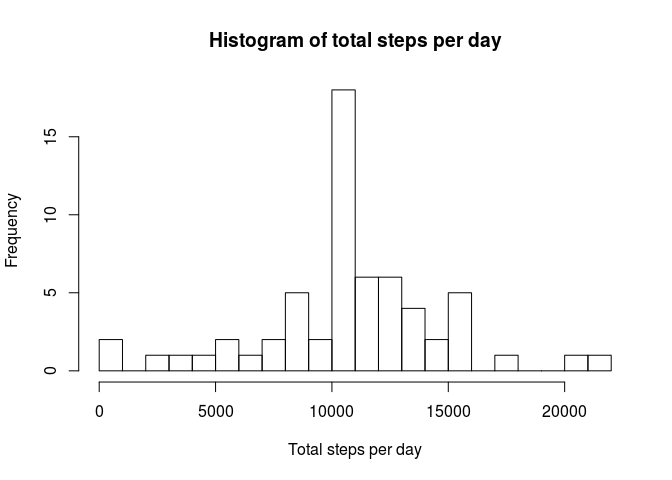
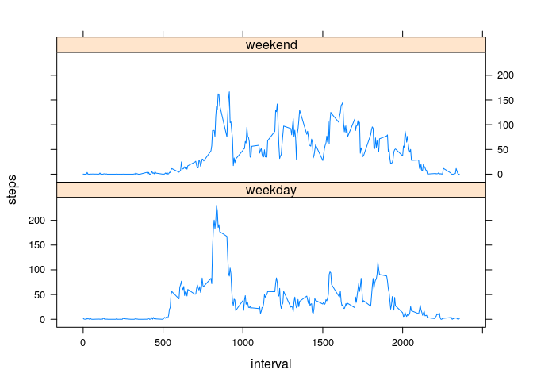

# Reproducible Research: Peer Assessment 1


## Download the zip file and unzip it


```r
download.file(url="https://d396qusza40orc.cloudfront.net/repdata%2Fdata%2Factivity.zip",destfile="activity.zip")
unzip("activity.zip")
```

## Read the file into a variable


```r
data <- read.csv2(file="activity.csv",quote='"',sep=",")
data$date <- as.Date(data$date)
```

## Insights

## Total steps per day


```r
hist(totalstepsperday$steps,breaks=20,xlab="Steps per day",main="Histogram of total steps per day")
```

<!-- -->

## Mean and Median steps per day 

```r
rawmean = mean(totalstepsperday$steps)
rawmedian = median(totalstepsperday$steps)
```

Mean of total steps per day is 9354.2295082 and 
Media of total steps per day is 10395

## Plot for avearage steps per interval


```r
plot(meanstepsperinterval$interval,meanstepsperinterval$steps,type='l')
```

<!-- -->

## Interval with Maximum steps averaged across all days


```r
meanstepsperinterval[meanstepsperinterval$steps == max(meanstepsperinterval$steps),]$interval
```

```
## [1] 835
```

## Number of rows with NA's


```r
library(dplyr)
```

```
## 
## Attaching package: 'dplyr'
```

```
## The following objects are masked from 'package:stats':
## 
##     filter, lag
```

```
## The following objects are masked from 'package:base':
## 
##     intersect, setdiff, setequal, union
```

```r
count(data[!complete.cases(data),])
```

```
## Source: local data frame [1 x 1]
## 
##       n
##   (int)
## 1  2304
```


## Imputing NA's with mean steps per interval


```r
imputeddata <- data
imputeddata[!complete.cases(imputeddata),]$steps <- meanstepsperinterval[match(imputeddata[!complete.cases(imputeddata),]$interval,meanstepsperinterval$interval),]$steps
```

## Histogram,mean and median after imputing


```r
imputedtotalstepsperday <- aggregate(imputeddata[1],list(Date=imputeddata$date),sum,na.rm=TRUE)
hist(imputedtotalstepsperday$steps,breaks=20,xlab = "Total steps per day",main = "Histogram of total steps per day")
```

<!-- -->

## Mean and Median after imputing data.


```r
imputedmean = mean(imputedtotalstepsperday$steps)
imputedmedian = median(imputedtotalstepsperday$steps)
```


Mean after imputation 1.0766189\times 10^{4} is higher than mean before imputation 9354.2295082 and median after(1.0766189\times 10^{4}) and before(10395) imputation remains approximately same

## Comparison of Weekday and Weekend activity


```r
library(lattice)
weekClass <- mutate(imputeddata,daytype = ifelse(weekdays(imputeddata$date) == "Saturday" | weekdays(imputeddata$date) == "Sunday","weekend","weekday"))
weekClass$daytype <- factor(weekClass$daytype)
daytypewise <- aggregate(steps~interval+daytype,data=weekClass,mean)
xyplot(steps~interval|daytype,data=daytypewise,type="l",layout=c(1,2))
```

<!-- -->

From the plot the mean for the intervals seems to be more than the corresponding intervals on week days.


